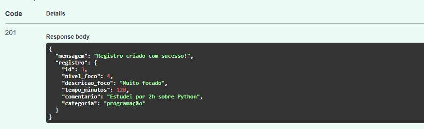
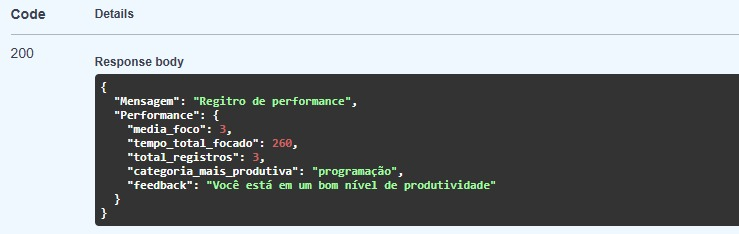
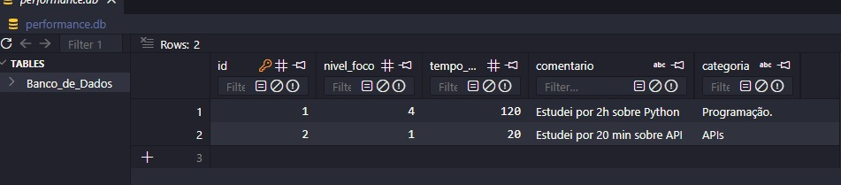

# API de Foco e Produtividade

API desenvolvida em Python utilizando FastAPI para registrar sessões de foco e gerar diagnósticos inteligentes de produtividade com base nos dados informados pelo usuário.

# Objetivo do Projeto

O objetivo da aplicação é permitir que usuários registrem períodos de estudo, trabalho ou desenvolvimento e recebam um diagnóstico automático baseado em:

* Média de foco
* Tempo total focado
* Categoria mais produtiva
* Feedback inteligente baseado no desempenho

---

# Tecnologias Utilizadas

* Python 3.12
* FastAPI
* SQLAlchemy
* SQLite
* Pydantic
* Uvicorn

---

# Funcionalidades

* Registro de sessões de foco
* Persistência de dados com SQLite
* Diagnóstico inteligente de produtividade
* Cálculo automático de média de foco
* Tempo total focado
* Categoria mais produtiva
* Feedback automático baseado nos registros
* Documentação automática com Swagger/OpenAPI

---

# Estrutura do Projeto

```bash
├── main.py
├── database.py
├── dependencies.py
├── models.py
├── schemas.py
├── foco_routes.py
├── performance_routes.py
├── images/
└── README.md
```

---

# Organização da Aplicação

## main.py

Responsável por iniciar a aplicação FastAPI e registrar os routers.

## database.py

Configuração da conexão com o banco SQLite.

## dependencies.py

Gerencia as sessões do banco utilizando dependency injection.

## models.py

Define os modelos/tabelas do banco de dados utilizando SQLAlchemy.

## schemas.py

Responsável pela validação dos dados utilizando Pydantic.

## foco_routes.py

Contém os endpoints relacionados ao registro de sessões de foco.

## performance_routes.py

Responsável pelos endpoints de diagnóstico e análise de produtividade.

---

# Utilização de Routers

O projeto utiliza APIRouter do FastAPI para separar responsabilidades dos endpoints, melhorando:

* Organização
* Escalabilidade
* Manutenção do código
* Legibilidade da aplicação

Essa abordagem evita arquivos muito grandes e deixa o backend mais modularizado.

---

# Endpoints

## POST /foco/registro-foco

Responsável por registrar uma nova sessão de foco.

### Exemplo de requisição

```json
{
  "nivel_foco": 5,
  "tempo_minutos": 120,
  "comentario": "Desenvolvimento da API utilizando FastAPI",
  "categoria": "programação"
}
```

---

## GET /performance/diagnostico-produtividade

Retorna um diagnóstico inteligente baseado nos registros armazenados.

### Exemplo de resposta

```json
{
  "media_foco": 4.5,
  "tempo_total_focado": 320,
  "total_registros": 4,
  "categoria_mais_produtiva": "programação",
  "feedback": "Parabéns, excelente desempenho, você está em estado de FLOW!!"
}
```

---

# Feedback Inteligente

A aplicação gera automaticamente feedbacks com base na média de foco registrada.

### Exemplos

* Média abaixo de 2 → Sugestão para reduzir distrações
* Média entre 2 e 4 → Sugestão para melhorar consistência
* Média acima de 4 → Feedback positivo de alta produtividade

---

# Imagens do Projeto

## Requisição de Registro de Foco



---

## Diagnóstico de Produtividade



---

## Banco de Dados SQLite



---

# Como Executar o Projeto

## 1. Clonar repositório

```bash
git clone https://github.com/DevPatrickF/API-de-foco-e-produtividade.git
```

## 2. Criar ambiente virtual

```bash
python -m venv venv
```

## 3. Ativar ambiente virtual

### Windows

```bash
venv\Scripts\activate
```

## 4. Instalar dependências

```bash
pip install -r requirements.txt
```

## 5. Executar aplicação

```bash
uvicorn main:app --reload
```

---

# Documentação Swagger

Após iniciar a aplicação:

```bash
http://127.0.0.1:8000/docs
```

---

# Autor

Desenvolvido por Patrick utilizando Python, FastAPI e SQLite.
